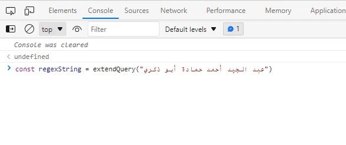

# extend-arabic-query

This package provides a function that returns a modified string with RegEx fixes to the most commonly found typos or unopenionated letter substitutions.



## Usage

Use the function `extendQuery(string)` **ONLY** in querying/search as the first argument for `RegExp()` or any other RegEx like `.match()` or `.replace()`. **NEVER** use it to fix actual strings.
As mentioned before, the function uses regular expressions (RegEx), so you can also make use of that by inserting any ECMAScript compatible regex syntax into the query, like capture groups (`()`) and search lists (`[]`) and lookaheads (`(?)`) and other syntax.

**Note** that, the function skips any text enclosed between `(`parenthesis`)` or `[`square parenthesis`]`. That's how it works, to avoid substituting the performed substitutions, which might eventually cause an infinit loop.

**Also, note that** it works by default on single line strings. So, if you are matching against a multiline string, simply add the `'m'` flag to the second argument in the `RegExp()` class.

## Install

Simply install the package into your project `node_modules/` via your package manager:

```
npm install extend-arabic-query
```

```
yarn extend-arabic-query
```

Then, import the function to your module or javascript file:

```js
import { extendQuery } from 'extend-arabic-query';
```
